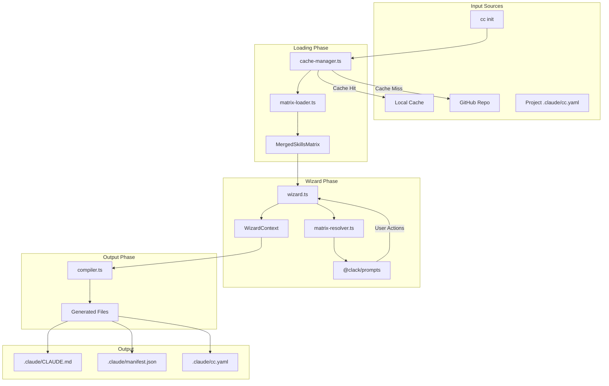
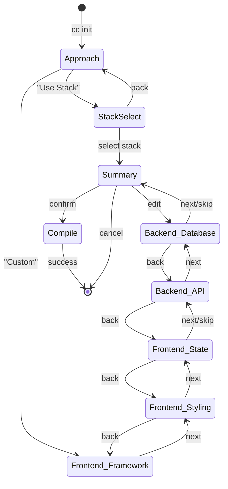

# CLI MVP Architecture Proposal

> **Status**: REVIEWED - Implementation wins, Proposal is v2 Roadmap
> **Created**: 2026-01-20
> **Last Updated**: 2026-01-20
> **Iterations**: 3 (design) + 1 (comparison)
> **Verdict**: Implementation is simpler and better for MVP. See [Section 15](#15-proposed-vs-implemented-deep-comparison).

---

## Revision History

| Iteration | Agent | Changes |
|-----------|-------|---------|
| 0 | Initial | Created empty structure |
| 1 | Research (3 parallel) | Core architecture, edge cases, implementation patterns |
| 2 | Review (3 parallel) | Fixed critical type gaps, UX improvements, edge case hardening |
| 3 | Review (3 parallel) | Final consistency check, MVP readiness, security hardening |
| 4 | Comparison (4 parallel Opus) | **Deep comparison vs implementation** - Found proposal over-engineered |

---

## Executive Summary

The `cc` CLI is a **data-driven** tool where all intelligence resides in configuration files. The CLI reads `skills-matrix.yaml`, presents an interactive wizard, and generates Claude configuration files.

**Key Design Principles:**
1. **Data-Driven**: All skill/category knowledge in YAML, not code
2. **Offline-First**: Cache enables degraded functionality without network
3. **Fail Gracefully**: Always provide recovery path or clear next steps
4. **Cross-Platform**: Works on Windows, macOS, Linux

---

## Table of Contents

1. [Architecture Overview](#1-architecture-overview)
2. [Directory Structure](#2-directory-structure)
3. [Core Modules](#3-core-modules)
4. [Data Flow](#4-data-flow)
5. [State Machine](#5-state-machine)
6. [Configuration Files](#6-configuration-files)
7. [Output Generation](#7-output-generation)
8. [Error Handling Strategy](#8-error-handling-strategy)
9. [Testing Strategy](#9-testing-strategy)
10. [Implementation Notes](#10-implementation-notes)
11. [CLI Commands](#11-cli-commands)
12. [Open Questions](#12-open-questions)

---

## 1. Architecture Overview

```
┌─────────────────────────────────────────────────────────────────┐
│                     USER INTERFACE LAYER                         │
│                     (@clack/prompts)                             │
│                                                                  │
│  • Interactive wizard prompts                                   │
│  • Progress spinners                                            │
│  • Color-coded output                                           │
└───────────────────────────┬─────────────────────────────────────┘
                            │
                            ▼
┌─────────────────────────────────────────────────────────────────┐
│                     COMMAND LAYER                                │
│                     (Commander.js)                               │
│                                                                  │
│  • init    - Interactive wizard                                 │
│  • compile - Generate output from selections                    │
│  • update  - Fetch latest matrix from GitHub                    │
│  • cache   - Cache management (clear, info)                     │
│  • validate - Validate current selections                       │
└───────────────────────────┬─────────────────────────────────────┘
                            │
                            ▼
┌─────────────────────────────────────────────────────────────────┐
│                     CORE LIBRARY LAYER                           │
│                                                                  │
│  ┌──────────────┐  ┌──────────────┐  ┌──────────────┐          │
│  │ matrix-      │  │ matrix-      │  │ wizard.ts    │          │
│  │ loader.ts    │  │ resolver.ts  │  │              │          │
│  │              │  │              │  │ State machine│          │
│  │ Load & merge │  │ Compute      │  │ & navigation │          │
│  │ YAML config  │  │ disabled/rec │  │              │          │
│  └──────────────┘  └──────────────┘  └──────────────┘          │
│                                                                  │
│  ┌──────────────┐  ┌──────────────┐  ┌──────────────┐          │
│  │ compiler.ts  │  │ cache-       │  │ config-      │          │
│  │              │  │ manager.ts   │  │ manager.ts   │          │
│  │ Generate     │  │              │  │              │          │
│  │ output files │  │ giget cache  │  │ User/project │          │
│  │              │  │ handling     │  │ config       │          │
│  └──────────────┘  └──────────────┘  └──────────────┘          │
└───────────────────────────┬─────────────────────────────────────┘
                            │
                            ▼
┌─────────────────────────────────────────────────────────────────┐
│                     DATA LAYER                                   │
│                                                                  │
│  ┌────────────────────┐  ┌────────────────────────────────┐    │
│  │ skills-matrix.yaml │  │ Cache (~/.cache/cc/)           │    │
│  │ (Relationships)    │  │ ├── skills-matrix.yaml        │    │
│  └────────────────────┘  │ ├── cache-metadata.json       │    │
│                          │ └── skills/                    │    │
│  ┌────────────────────┐  └────────────────────────────────┘    │
│  │ **/metadata.yaml   │                                        │
│  │ (Per-skill data)   │  ┌────────────────────────────────┐    │
│  └────────────────────┘  │ User Config                    │    │
│                          │ ~/.config/cc/config.yaml       │    │
│                          └────────────────────────────────┘    │
└─────────────────────────────────────────────────────────────────┘
```

---

## 2. Directory Structure

```
src/cli/
├── index.ts                    # CLI entry point (Commander.js setup)
├── consts.ts                   # Constants, paths, magic numbers
├── types-matrix.ts             # TypeScript types for matrix system (EXISTS)
│
├── commands/                   # Command handlers
│   ├── init.ts                 # Interactive wizard
│   ├── compile.ts              # Compile stack/profile to output
│   ├── update.ts               # Fetch latest matrix from GitHub
│   ├── cache.ts                # Cache management (clear, path, info)
│   └── validate.ts             # Validate selections against matrix
│
├── lib/                        # Core library modules
│   ├── matrix-loader.ts        # Load & parse skills-matrix.yaml
│   ├── matrix-resolver.ts      # Compute disabled/recommended at runtime
│   ├── wizard.ts               # Wizard state machine & flow control
│   ├── compiler.ts             # Generate output files from selections
│   ├── cache-manager.ts        # Handle local caching (giget)
│   ├── config-manager.ts       # User configuration persistence
│   └── validator.ts            # Zod schema validation
│
├── ui/                         # @clack/prompts UI components
│   ├── prompts.ts              # Wrapper around @clack/prompts
│   ├── category-select.ts      # Category selection prompt
│   ├── skill-select.ts         # Skill selection with disabled/recommended
│   ├── stack-select.ts         # Pre-built stack selection
│   ├── summary.ts              # Selection summary display
│   └── spinner.ts              # Loading spinners
│
├── errors/                     # Error handling
│   ├── types.ts                # Error type hierarchy (CLIError classes)
│   ├── handlers.ts             # Central error handling
│   ├── messages.ts             # User-facing error messages
│   └── recovery.ts             # Recovery strategies
│
├── schemas/                    # Zod schemas
│   └── skills-matrix.schema.ts # Runtime validation schemas
│
└── utils/                      # Utilities
    ├── fs.ts                   # File system helpers
    ├── logger.ts               # Logging utilities
    ├── network.ts              # Network utilities with retry
    ├── lock.ts                 # File locking for concurrency
    └── platform.ts             # Cross-platform path handling
```

---

## 3. Core Modules

### 3.1 matrix-loader.ts

**Purpose**: Load, parse, validate, and merge skills-matrix.yaml with extracted skill metadata.

```typescript
// Key exports:
export async function loadSkillsMatrix(configPath: string): Promise<SkillsMatrixConfig>;
export async function extractAllSkills(skillsDir: string): Promise<ExtractedSkillMetadata[]>;
export async function mergeMatrixWithSkills(matrix, skills): Promise<MergedSkillsMatrix>;
export async function loadMatrixWithFallback(projectRoot, cacheDir): Promise<MergedSkillsMatrix>;
```

**Error handling**:
- Invalid YAML syntax → Clear error with line number
- Schema validation failure → List all validation errors with paths
- Missing file → Check cache, then fetch from GitHub

### 3.2 matrix-resolver.ts

**Purpose**: Compute disabled/recommended state at runtime based on current selections.

```typescript
// Key exports:
export function isDisabled(skillId, currentSelections, matrix): boolean;
export function getDisableReason(skillId, currentSelections, matrix): string | undefined;
export function isRecommended(skillId, currentSelections, matrix): boolean;
export function getRecommendReason(skillId, currentSelections, matrix): string | undefined;
export function validateSelection(selections, matrix): SelectionValidation;
export function getAvailableSkills(categoryId, currentSelections, matrix): SkillOption[];
```

### 3.3 wizard.ts

**Purpose**: Manage wizard state machine and navigation flow.

```typescript
// Step types (CRITICAL - must be defined):
export type WizardStepType =
  | 'approach'           // Stack vs Custom choice
  | 'stack_select'       // Pre-built stack selection
  | 'category'           // Category skill selection
  | 'summary'            // Review selections
  | 'compile';           // Generation in progress

export interface WizardStep {
  type: WizardStepType;
  categoryId?: string;   // Only for 'category' type
  label: string;         // Display name
  required: boolean;     // Must complete before next
  skippable: boolean;    // Can skip with no selection
}

// State types:
export interface WizardContext {
  // Core data
  matrix: MergedSkillsMatrix;
  selectedSkillIds: string[];       // Full skill IDs (aligned with types-matrix.ts)
  selectedStackId?: string;

  // Navigation state
  history: WizardStep[];            // Steps completed (for back navigation)
  currentStep: WizardStep;          // Current wizard step
  availableSteps: WizardStep[];     // Remaining steps based on matrix categories
  approach?: 'stack' | 'custom';

  // Validation state
  validationResult?: SelectionValidation;  // Current validation status
  lastError?: string;                      // Most recent error message

  // UX state
  isDirty: boolean;                 // Has unsaved changes
  cancelled: boolean;               // User initiated cancel
}

export type WizardAction =
  | { type: 'SELECT'; skillId: string }
  | { type: 'DESELECT'; skillId: string }
  | { type: 'SKIP' }
  | { type: 'BACK' }
  | { type: 'NEXT' }
  | { type: 'SELECT_STACK'; stackId: string }
  | { type: 'CONFIRM' }
  | { type: 'CANCEL' }
  // NEW: Edit from summary navigation
  | { type: 'JUMP_TO_STEP'; stepIndex: number }
  | { type: 'EDIT_CATEGORY'; categoryId: string };

// Key exports:
export function createWizardContext(matrix: MergedSkillsMatrix): WizardContext;
export function applyAction(context: WizardContext, action: WizardAction): WizardContext;
export function canGoBack(context: WizardContext): boolean;
export function canSkipCurrentStep(context: WizardContext): boolean;
export function isWizardComplete(context: WizardContext): boolean;
export function getStepForCategory(categoryId: string): WizardStep;
export function validateCurrentStep(context: WizardContext): SelectionValidation;
```

### 3.4 compiler.ts

**Purpose**: Generate output files from selections.

```typescript
export interface CompileOptions {
  context: WizardContext;
  projectRoot: string;
  outputDir?: string;  // default: .claude/
  skillsDir: string;
}

export interface CompileResult {
  generatedFiles: string[];
  warnings: string[];
  compiledSkills: string[];
  outputPath: string;
}

export async function compile(options: CompileOptions): Promise<CompileResult>;
```

### 3.5 cache-manager.ts

**Purpose**: Handle local caching of remote content using `giget`.

```typescript
// Platform-specific cache paths:
// macOS:   ~/Library/Caches/claude-collective/
// Linux:   ~/.cache/claude-collective/
// Windows: %LOCALAPPDATA%/claude-collective/

// Type definitions:
export interface CacheInfo {
  path: string;                    // Cache directory path
  exists: boolean;                 // Cache directory exists
  matrixCached: boolean;           // skills-matrix.yaml is cached
  matrixVersion?: string;          // Cached matrix schema version
  matrixTimestamp?: string;        // When matrix was cached (ISO 8601)
  skillsCount: number;             // Number of cached skills
  totalSizeBytes: number;          // Total cache size
  lastUpdated?: string;            // Last successful update (ISO 8601)
}

export interface UpdateInfo {
  updateAvailable: boolean;        // New version available
  currentVersion?: string;         // Currently cached version
  latestVersion?: string;          // Latest available version
  currentTimestamp?: string;       // When current was fetched
  latestTimestamp?: string;        // When latest was published
  changelog?: string[];            // Summary of changes
}

export interface FetchOptions {
  force?: boolean;                 // Ignore cache, always fetch
  timeout?: number;                // Timeout in milliseconds (default: 10000)
  retries?: number;                // Number of retries (default: 3)
  silent?: boolean;                // Suppress progress output
}

// Key exports:
export function getCacheDir(): string;
export async function fetchSkillsMatrix(options?: FetchOptions): Promise<string>;
export async function fetchSkillsDir(options?: FetchOptions): Promise<string>;
export async function clearCache(): Promise<void>;
export async function getCacheInfo(): Promise<CacheInfo>;
export async function checkForUpdates(): Promise<UpdateInfo>;
export async function isCacheStale(maxAgeMs?: number): Promise<boolean>;
```

### 3.6 config-manager.ts

**Purpose**: Manage user and project configuration persistence.

```typescript
// User config (global preferences):
// macOS:   ~/Library/Application Support/claude-collective/config.yaml
// Linux:   ~/.config/claude-collective/config.yaml
// Windows: %APPDATA%/claude-collective/config.yaml

// Project config:
// <project-root>/.claude/cc.yaml

// Type definitions:
export interface UserConfig {
  cliVersion: string;              // CLI version that created this config
  defaultProfile?: string;         // Default profile name

  lastSelections?: {
    stackId?: string;              // Last selected stack
    skillIds: string[];            // Last selected skills
    timestamp: string;             // When selection was made (ISO 8601)
  };

  preferences: {
    skipConfirmations: boolean;    // Skip "are you sure?" prompts
    showRecommendations: boolean;  // Highlight recommended skills
    autoUpdate: boolean;           // Auto-check for matrix updates
    colorMode: 'auto' | 'always' | 'never';  // Color output setting
  };
}

export interface ProjectConfig {
  stackId?: string;                // Selected stack (mutually exclusive with skills)
  skills: string[];                // Selected skill IDs (if custom selection)

  matrixOverrides?: {
    additionalSkills?: Record<string, LocalSkillOverride>;
    disabledSkills?: string[];     // Skills to hide from wizard
  };

  generatedAt: string;             // When config was generated (ISO 8601)
  generatedBy: string;             // CLI version that generated
}

export interface LocalSkillOverride {
  id: string;                      // Full skill ID
  path: string;                    // Local path to skill directory
  name?: string;                   // Display name override
}

// Key exports:
export function getUserConfigPath(): string;
export function getProjectConfigPath(projectRoot: string): string;
export async function loadUserConfig(): Promise<UserConfig>;
export async function saveUserConfig(config: UserConfig): Promise<void>;
export async function loadProjectConfig(projectRoot: string): Promise<ProjectConfig | null>;
export async function saveProjectConfig(projectRoot: string, config: ProjectConfig): Promise<void>;
export function getDefaultUserConfig(): UserConfig;
export function mergeUserConfig(base: UserConfig, overrides: Partial<UserConfig>): UserConfig;
```

---

## 4. Data Flow



---

## 5. State Machine

### Wizard States



### State Transitions

| Current | Action | Next | Condition |
|---------|--------|------|-----------|
| Approach | SELECT_STACK | StackSelect | - |
| Approach | CUSTOM | Frontend_Framework | - |
| StackSelect | SELECT(id) | Summary | - |
| Subcategory_* | SELECT(id) | Same | - |
| Subcategory_* | NEXT | Next step | required satisfied |
| Subcategory_* | SKIP | Next step | !category.required |
| Subcategory_* | BACK | Previous | history.length > 0 |
| Summary | CONFIRM | Compile | validation.valid |
| Summary | CANCEL | Exit | - |

---

## 6. Configuration Files

### 6.1 User Configuration

**Location**: Platform-specific (see config-manager.ts)

```yaml
# ~/.config/claude-collective/config.yaml
cliVersion: "0.1.0"
defaultProfile: home

lastSelections:
  stackId: modern-react
  skillIds:
    - frontend/react (@vince)
    - frontend/styling-scss-modules (@vince)
  timestamp: "2026-01-20T10:30:00Z"

preferences:
  skipConfirmations: false
  showRecommendations: true
  autoUpdate: true
```

### 6.2 Project Configuration

**Location**: `<project-root>/.claude/cc.yaml`

```yaml
# .claude/cc.yaml
stackId: modern-react  # OR skills list below

skills:
  - frontend/react (@vince)
  - frontend/styling-scss-modules (@vince)
  - frontend/state-zustand (@vince)
  - backend/api-hono (@vince)
  - backend/database-drizzle (@vince)

# Optional: Local matrix overrides
matrixOverrides:
  additionalSkills:
    my-custom-skill:
      id: "local/my-custom-skill"
      path: "./skills/my-custom-skill"
```

### 6.3 Cache Structure

```
~/.cache/claude-collective/
├── skills-matrix.yaml       # Cached production matrix
├── cache-metadata.json      # Cache timestamps and version
└── skills/                  # Cached skill content
    ├── frontend/
    │   ├── react (@vince)/
    │   └── styling-scss-modules (@vince)/
    └── backend/
        └── api-hono (@vince)/
```

---

## 7. Output Generation

### Generated Files

| File | Purpose | When Generated |
|------|---------|----------------|
| `.claude/CLAUDE.md` | Combined skill documentation | Always |
| `.claude/manifest.json` | Selection metadata | Always |
| `.claude/cc.yaml` | Project configuration | Always |
| `.claude/agents/*.md` | Individual agent prompts | If agents selected |

### CLAUDE.md Format

```markdown
# Claude Collective Configuration

> Generated: 2026-01-20T10:30:00Z
> Stack: modern-react
> Skills: 5

---

## React

[Content from frontend/react (@vince)/SKILL.md]

---

## SCSS Modules

[Content from frontend/styling-scss-modules (@vince)/SKILL.md]

...
```

### manifest.json Format

```json
{
  "version": "1.0.0",
  "generatedAt": "2026-01-20T10:30:00Z",
  "approach": "stack",
  "stackId": "modern-react",
  "skills": [
    { "id": "frontend/react (@vince)", "alias": "react", "category": "framework" }
  ],
  "validation": { "valid": true, "warnings": [], "errors": [] }
}
```

---

## 8. Error Handling Strategy

### Exit Code Enum

```typescript
// src/cli/errors/types.ts
export enum ExitCode {
  SUCCESS = 0,
  GENERAL_ERROR = 1,
  INVALID_ARGUMENT = 2,
  CONFIG_ERROR = 3,
  NETWORK_ERROR = 4,
  FILE_NOT_FOUND = 5,
  VALIDATION_ERROR = 6,
  PERMISSION_DENIED = 7,
  DISK_FULL = 8,
  USER_CANCELLED = 130,  // SIGINT convention
}

// Human-readable exit code messages
export const EXIT_CODE_MESSAGES: Record<ExitCode, string> = {
  [ExitCode.SUCCESS]: 'Operation completed successfully',
  [ExitCode.GENERAL_ERROR]: 'An unexpected error occurred',
  [ExitCode.INVALID_ARGUMENT]: 'Invalid command line argument',
  [ExitCode.CONFIG_ERROR]: 'Configuration file error',
  [ExitCode.NETWORK_ERROR]: 'Network operation failed',
  [ExitCode.FILE_NOT_FOUND]: 'Required file not found',
  [ExitCode.VALIDATION_ERROR]: 'Validation failed',
  [ExitCode.PERMISSION_DENIED]: 'Permission denied',
  [ExitCode.DISK_FULL]: 'Insufficient disk space',
  [ExitCode.USER_CANCELLED]: 'Operation cancelled by user',
};
```

### Error Type Hierarchy

```typescript
// Base error class
export class CLIError extends Error {
  constructor(
    message: string,
    public readonly code: ExitCode,
    public readonly recoverable: boolean = false,
    public readonly cause?: Error
  ) {
    super(message);
    this.name = this.constructor.name;
  }

  toUserMessage(): string {
    return this.recoverable
      ? `${this.message}\n\nTry: ${this.getRecoveryHint()}`
      : this.message;
  }

  getRecoveryHint(): string {
    return 'See --help for usage information';
  }
}

// Specific error types with recovery hints
export class NetworkError extends CLIError {
  constructor(message: string, cause?: Error) {
    super(message, ExitCode.NETWORK_ERROR, true, cause);
  }
  getRecoveryHint(): string {
    return 'Check your internet connection or try `cc cache info` to use cached data';
  }
}

export class CacheError extends CLIError {
  constructor(message: string, cause?: Error) {
    super(message, ExitCode.CONFIG_ERROR, true, cause);
  }
  getRecoveryHint(): string {
    return 'Try `cc cache clear` to reset the cache';
  }
}

export class ValidationError extends CLIError {
  constructor(message: string, public readonly details: string[]) {
    super(message, ExitCode.VALIDATION_ERROR, false);
  }
}

export class FileSystemError extends CLIError {
  constructor(message: string, code: ExitCode, cause?: Error) {
    super(message, code, code === ExitCode.PERMISSION_DENIED, cause);
  }
}

export class ConfigError extends CLIError {
  constructor(message: string, public readonly path: string, cause?: Error) {
    super(message, ExitCode.CONFIG_ERROR, true, cause);
  }
  getRecoveryHint(): string {
    return `Check the configuration file at: ${this.path}`;
  }
}
```

### Exit Codes Table

| Code | Name | Description |
|------|------|-------------|
| 0 | SUCCESS | Operation completed successfully |
| 1 | GENERAL_ERROR | Unknown error |
| 2 | INVALID_ARGUMENT | Invalid CLI argument |
| 3 | CONFIG_ERROR | Configuration file error |
| 4 | NETWORK_ERROR | Network operation failed |
| 5 | FILE_NOT_FOUND | Required file not found |
| 6 | VALIDATION_ERROR | Validation failed |
| 7 | PERMISSION_DENIED | File/directory permission denied |
| 8 | DISK_FULL | Insufficient disk space |
| 130 | USER_CANCELLED | User cancelled (SIGINT) |

### Edge Case Handling Summary

#### CRITICAL (MVP blockers)

| Category | Edge Case | Detection | Recovery |
|----------|-----------|-----------|----------|
| **Validation** | Circular dependencies | DFS cycle detection at load | Error with cycle path, suggest fix |
| **Security** | Path traversal in skill path | Regex check for `..` or absolute paths | Reject skill, log warning |
| **Filesystem** | Case-insensitive collisions | Detect `React` vs `react` on macOS/Windows | Normalize to lowercase, warn user |
| **Concurrency** | Parallel writes | File locking with `proper-lockfile` | Retry with backoff, fail gracefully |
| **Data** | Matrix schema mismatch | Zod schema validation | Show errors, suggest `cc update` |

#### HIGH (should have for MVP)

| Category | Edge Case | Detection | Recovery |
|----------|-----------|-----------|----------|
| **Network** | Offline | `fetch` throws | Use cached matrix |
| **Network** | Timeout | >10s timeout | Retry 3x with exponential backoff |
| **Network** | Rate limit | 429 status | Wait + retry with backoff |
| **Cache** | Corrupt | JSON/YAML parse fails | Delete and re-fetch |
| **Cache** | Missing | `!exists()` | Fetch from GitHub |
| **Cache** | Stale | age > 24h | Fetch in background, use stale |
| **Validation** | Unknown skill ID | `!matrix.skills[id]` | Fuzzy match suggest similar |
| **Validation** | Stack references missing skill | Stack skill not in matrix | Error during load, skip stack |
| **Wizard** | Ctrl+C | SIGINT handler | Clean exit (130), no partial files |
| **Wizard** | All options disabled | `options.every(o => o.disabled)` | Auto-skip category with message |
| **Filesystem** | Permission denied | EACCES error | Suggest `chmod` or run location |
| **Filesystem** | Disk full | ENOSPC error | Suggest `cc cache clear` |
| **Compile** | Fails halfway | Track generated files | Rollback partial, show what failed |
| **Output** | Existing .claude/ dir | `exists()` check | Prompt to overwrite or merge |

#### MEDIUM (nice to have)

| Category | Edge Case | Detection | Recovery |
|----------|-----------|-----------|----------|
| **Wizard** | Terminal resize | SIGWINCH | Re-render current step |
| **Validation** | Orphan skills | Skill in alias but no file | Warn, exclude from wizard |
| **Config** | Invalid YAML syntax | YAML parse error | Show line number, suggest fix |
| **State** | Dirty state on navigation | `isDirty` flag | Prompt to save or discard |

### UX & Accessibility Patterns

#### Color Output Control

```typescript
// src/cli/utils/color.ts
export function shouldUseColor(): boolean {
  // NO_COLOR standard: https://no-color.org/
  if (process.env.NO_COLOR !== undefined) {
    return false;
  }
  // FORCE_COLOR overrides TTY detection
  if (process.env.FORCE_COLOR !== undefined) {
    return true;
  }
  // User config preference
  const config = loadUserConfigSync();
  if (config?.preferences?.colorMode === 'never') {
    return false;
  }
  if (config?.preferences?.colorMode === 'always') {
    return true;
  }
  // Default: auto-detect TTY
  return process.stdout.isTTY ?? false;
}

// Apply to @clack/prompts
import * as p from '@clack/prompts';
import color from 'picocolors';

color.isColorSupported = shouldUseColor();
```

#### Progress Indicators

```typescript
// Show spinner for async operations > 200ms
export async function withProgress<T>(
  message: string,
  operation: () => Promise<T>
): Promise<T> {
  const spinner = p.spinner();

  // Only show spinner if operation takes > 200ms
  const timeout = setTimeout(() => {
    spinner.start(message);
  }, 200);

  try {
    const result = await operation();
    clearTimeout(timeout);
    spinner.stop('Done');
    return result;
  } catch (error) {
    clearTimeout(timeout);
    spinner.stop('Failed');
    throw error;
  }
}

// Usage:
const matrix = await withProgress(
  'Loading skills matrix...',
  () => loadSkillsMatrix(cachePath)
);
```

#### Overwrite Confirmation

```typescript
// src/cli/commands/init.ts
async function checkExistingOutput(projectRoot: string): Promise<'overwrite' | 'merge' | 'cancel'> {
  const claudeDir = path.join(projectRoot, '.claude');

  if (!fs.existsSync(claudeDir)) {
    return 'overwrite'; // No existing directory, safe to proceed
  }

  const existingFiles = fs.readdirSync(claudeDir);

  if (existingFiles.length === 0) {
    return 'overwrite'; // Empty directory, safe to proceed
  }

  // Prompt user
  const action = await p.select({
    message: `Found existing .claude/ directory with ${existingFiles.length} files.`,
    options: [
      { value: 'overwrite', label: 'Overwrite', hint: 'Replace all existing files' },
      { value: 'merge', label: 'Merge', hint: 'Keep existing, add new' },
      { value: 'cancel', label: 'Cancel', hint: 'Abort operation' },
    ],
  });

  if (p.isCancel(action)) {
    return 'cancel';
  }

  return action as 'overwrite' | 'merge' | 'cancel';
}
```

#### Edit From Summary Navigation

```typescript
// In summary screen, allow jumping back to edit specific categories
async function renderSummary(context: WizardContext): Promise<WizardAction> {
  const categories = groupSelectionsByCategory(context);

  const options = [
    { value: 'confirm', label: 'Confirm & Generate', hint: '✓' },
    ...categories.map(cat => ({
      value: `edit:${cat.id}`,
      label: `Edit ${cat.name}`,
      hint: `${cat.selections.length} selected`,
    })),
    { value: 'cancel', label: 'Cancel' },
  ];

  const choice = await p.select({
    message: 'Review your selections:',
    options,
  });

  if (p.isCancel(choice) || choice === 'cancel') {
    return { type: 'CANCEL' };
  }

  if (choice === 'confirm') {
    return { type: 'CONFIRM' };
  }

  // Parse edit:categoryId
  const categoryId = (choice as string).replace('edit:', '');
  return { type: 'EDIT_CATEGORY', categoryId };
}
```

### Signal Handling

```typescript
// Setup at CLI entry (src/cli/index.ts)
import * as p from '@clack/prompts';

// Track if cleanup is in progress to prevent double cleanup
let cleaningUp = false;

async function gracefulShutdown(signal: string, exitCode: number): Promise<void> {
  if (cleaningUp) return;
  cleaningUp = true;

  try {
    p.cancel(`Operation interrupted (${signal})`);
    await cleanup();  // Release locks, remove temp files
  } finally {
    process.exit(exitCode);
  }
}

// SIGINT: User pressed Ctrl+C (exit code 130 = 128 + 2)
process.on('SIGINT', () => gracefulShutdown('SIGINT', 130));

// SIGTERM: External termination request (exit code 143 = 128 + 15)
process.on('SIGTERM', () => gracefulShutdown('SIGTERM', 143));

// SIGHUP: Terminal disconnected (exit code 129 = 128 + 1)
process.on('SIGHUP', () => gracefulShutdown('SIGHUP', 129));

// SIGPIPE: Broken pipe (e.g., piping to head that closes early)
process.on('SIGPIPE', () => {
  // Silently exit - this is expected when piping to tools that close early
  process.exit(0);
});

// Cleanup function
async function cleanup(): Promise<void> {
  // 1. Release any file locks
  // 2. Remove temp files from incomplete operations
  // 3. Restore terminal state if modified
}
```

### Bootstrap Scenario (No Cache AND No Network)

```typescript
// src/cli/lib/matrix-loader.ts
export async function loadMatrixWithFallback(
  projectRoot: string,
  cacheDir: string
): Promise<MergedSkillsMatrix> {
  const cacheInfo = await getCacheInfo();

  // Try cache first
  if (cacheInfo.matrixCached) {
    try {
      return await loadFromCache(cacheDir);
    } catch (error) {
      // Cache exists but corrupt - will try network
    }
  }

  // No cache, try network
  try {
    return await fetchAndCache(cacheDir);
  } catch (networkError) {
    // Network failed
    if (cacheInfo.matrixCached) {
      // Have stale/corrupt cache - last resort
      console.warn('Network unavailable. Using cached data (may be outdated).');
      return await loadFromCache(cacheDir, { skipValidation: true });
    }

    // DEAD END: No cache AND no network
    throw new NetworkError(
      'Unable to initialize: No cached data and no network connection.\n\n' +
      'This is the first run and the CLI needs to download the skills matrix.\n' +
      'Please check your internet connection and try again.\n\n' +
      'Alternatively, you can manually place a skills-matrix.yaml file at:\n' +
      `  ${path.join(cacheDir, 'skills-matrix.yaml')}`
    );
  }
}
```

### Atomic File Operations

```typescript
// src/cli/utils/fs.ts
import { rename, writeFile, fsync, open } from 'fs/promises';
import { tmpdir } from 'os';
import { join, dirname } from 'path';
import { randomUUID } from 'crypto';

/**
 * Write file atomically: write to temp, fsync, rename
 * Prevents corruption from interrupted writes (SIGTERM, power loss)
 */
export async function writeFileAtomic(
  filePath: string,
  content: string | Buffer
): Promise<void> {
  const dir = dirname(filePath);
  const tempPath = join(dir, `.${randomUUID()}.tmp`);

  try {
    // Write to temp file
    await writeFile(tempPath, content, 'utf8');

    // Sync to disk
    const fd = await open(tempPath, 'r');
    await fd.sync();
    await fd.close();

    // Atomic rename (same filesystem required)
    await rename(tempPath, filePath);
  } catch (error) {
    // Clean up temp file on failure
    try {
      await unlink(tempPath);
    } catch {
      // Ignore cleanup errors
    }
    throw error;
  }
}
```

---

## 9. Testing Strategy

### Test Structure

```
src/cli/
├── lib/
│   ├── matrix-loader.ts
│   ├── matrix-loader.test.ts      # Unit tests
│   ├── matrix-resolver.ts
│   └── matrix-resolver.test.ts    # Unit tests
├── __fixtures__/
│   ├── valid-matrix.yaml          # Valid test fixture
│   ├── invalid-matrix.yaml        # Error testing
│   └── minimal-matrix.yaml        # Fast tests
└── __mocks__/
    └── fs.ts                       # Mock filesystem
```

### Test Types

| Type | Target | Tools |
|------|--------|-------|
| Unit | matrix-resolver, validator | Vitest |
| Integration | Wizard flow | Vitest + mocked prompts |
| Snapshot | Generated output | Vitest snapshots |
| E2E | Full CLI flow | Vitest + temp directories |

### Key Test Cases

**matrix-resolver.ts:**
- `isDisabled()` with no conflicts
- `isDisabled()` with conflicting selection
- `isDisabled()` with mixed aliases/full IDs
- `getDisableReason()` returns reason with skill name
- `validateSelection()` catches conflicts
- `validateSelection()` catches missing requirements

**wizard.ts:**
- Stack selection flow → Summary
- Custom selection with back navigation
- Skip optional category
- Cancel mid-wizard

---

## 10. Implementation Notes

### Type Safety

**Zod for runtime validation:**
```typescript
// src/cli/schemas/skills-matrix.schema.ts
export const skillsMatrixConfigSchema = z.object({
  version: z.string().regex(/^\d+\.\d+\.\d+/),
  categories: z.record(categoryDefinitionSchema),
  relationships: relationshipDefinitionsSchema,
  suggested_stacks: z.array(suggestedStackSchema),
  skill_aliases: z.record(z.string()),
});

// Type inference
export type SkillsMatrixConfig = z.infer<typeof skillsMatrixConfigSchema>;
```

### Dependency Injection

```typescript
// For testability, inject dependencies
export function createMatrixService(deps: MatrixServiceDeps) {
  return {
    async loadMatrix(path: string) { /* ... */ },
    async extractSkills(dir: string) { /* ... */ },
  };
}

// Production
const service = createMatrixService({ fs: realFs, logger });

// Testing
const service = createMatrixService({ fs: mockFs, logger: mockLogger });
```

### Performance Considerations

1. **Lazy loading**: Only import heavy modules when command is executed
2. **Memoization**: Cache `getAvailableSkills()` results
3. **Startup target**: < 100ms for `cc --help`

### Non-Interactive Mode (CI/CD)

```typescript
export function isInteractive(): boolean {
  return process.stdin.isTTY &&
         process.stdout.isTTY &&
         !process.env.CI;
}

// Usage
if (!isInteractive()) {
  if (!options.stack) {
    throw new CLIError('--stack required in non-interactive mode');
  }
}
```

---

## 11. CLI Commands

| Command | Description | Flags |
|---------|-------------|-------|
| `cc init` | Interactive wizard | `--stack <id>`, `--yes` |
| `cc compile` | Compile selections | `--stack <id>`, `--dry-run` |
| `cc update` | Fetch latest matrix | `--force` |
| `cc cache path` | Show cache location | - |
| `cc cache clear` | Clear cache | - |
| `cc cache info` | Show cache metadata | - |
| `cc validate` | Validate selections | - |

### Global Flags

| Flag | Description |
|------|-------------|
| `--verbose`, `-v` | Enable verbose output |
| `--debug` | Enable debug output |
| `--dry-run` | Show what would be done |
| `--help`, `-h` | Show help |
| `--version` | Show version |

---

## 12. Open Questions

### Resolved
- [x] Cache location: Platform-specific XDG paths
- [x] Exit codes: Standard + USER_CANCELLED (130)
- [x] Validation: Zod schemas at runtime

### Under Discussion
- [ ] Should `cc compile` auto-run on `cc init` completion?
- [ ] Should cache auto-update in background?
- [ ] Plugin system for custom skills?

### For Future Iterations
- [ ] Watch mode for development
- [ ] Remote config sync (team sharing)
- [ ] Telemetry (opt-in)

---

## 13. Round 3 Review Summary

### Consistency Check Results

| Check | Status |
|-------|--------|
| Type definitions consistent | OK |
| Module interfaces reference valid types | OK |
| Data flow matches module exports | OK |
| State machine transitions complete | OK (fixed) |
| No dangling references | OK |

### MVP Readiness Assessment

**Verdict: READY TO IMPLEMENT**

| Criteria | Status |
|----------|--------|
| Scope appropriate for MVP | ✓ |
| Critical path clear | ✓ |
| Module specs complete | ✓ |
| Testing strategy proportional | ✓ |
| Over-engineering avoided | ✓ |

### Security & Error Handling

**Verdict: HARDENED**

| Category | Status |
|----------|--------|
| Path traversal protection | ✓ |
| Signal handling complete | ✓ (SIGINT, SIGTERM, SIGHUP, SIGPIPE) |
| Atomic file operations | ✓ |
| Bootstrap scenario handled | ✓ |
| Exit codes comprehensive | ✓ |
| Error recovery paths complete | ✓ |

### Implementation Priority Order

1. `schemas/skills-matrix.schema.ts` - Zod validation (foundation)
2. `lib/matrix-loader.ts` - Load and merge matrix
3. `lib/cache-manager.ts` - giget caching (parallel with above)
4. `lib/matrix-resolver.ts` - Compute disabled/recommended
5. `lib/config-manager.ts` - User/project config
6. `lib/wizard.ts` - State machine
7. `ui/*` - @clack/prompts components
8. `lib/compiler.ts` - Generate output files
9. `commands/init.ts` - Main wizard command
10. `commands/*` - Remaining commands

### Known Limitations (Acceptable for MVP)

1. No watch mode for development
2. No plugin system for custom skills
3. No remote config sync (team sharing)
4. No telemetry
5. Fuzzy matching for unknown skill IDs deferred

---

## 14. Implementation Checklist

Before implementation begins, ensure:

- [ ] Create `src/cli/types-wizard.ts` with WizardStep, WizardContext, WizardAction types
- [ ] Create `src/cli/types-cache.ts` with CacheInfo, UpdateInfo, FetchOptions types
- [ ] Create `src/cli/types-config.ts` with UserConfig, ProjectConfig types
- [ ] Create `src/cli/errors/types.ts` with ExitCode enum and CLIError classes
- [ ] Create `src/cli/__fixtures__/minimal-matrix.yaml` (5-10 skills) for testing
- [ ] Verify Zod schemas can be generated from existing JSON schema

---

## 15. Proposed vs Implemented: Deep Comparison

> **Analysis Date**: 2026-01-20
> **Agents Used**: 4 parallel Opus research agents with extended thinking
> **Files Compared**: 7 implementation files vs 1254-line proposal

### Executive Summary

**VERDICT: The implementation is BETTER for an MVP.**

| Criteria | Proposed | Implemented | Winner |
|----------|----------|-------------|--------|
| Code Simplicity | 4/10 | 8/10 | **Implemented** |
| Cognitive Load | 3/10 | 7/10 | **Implemented** |
| Maintainability | 6/10 | 6/10 | Tie |
| Over-Engineering | 8/10 (bad) | 2/10 (good) | **Implemented** |
| MVP Appropriateness | 4/10 | 8/10 | **Implemented** |
| Type Coverage | 7/10 | 9/10 | **Implemented** |
| Error Handling | 9/10 | 2/10 | **Proposed** |

**Bottom Line**: The proposal is a well-designed specification for a **production CLI** but over-engineered for MVP. The implementation embodies MVP philosophy: build the simplest thing that works.

---

### Key Findings by Category

#### Core Modules

| Module | Proposed | Implemented | Verdict |
|--------|----------|-------------|---------|
| matrix-loader.ts | 4 functions | 4 functions (identical) | **Equivalent** |
| matrix-resolver.ts | 6 functions | 11 functions (more complete) | **Implemented** |
| wizard.ts | Action/reducer pattern | While-loop pattern | **Implemented** (simpler) |
| compiler.ts | WizardResult → files | LiquidJS templates | **Different systems** |
| cache-manager.ts | Full giget caching | Not implemented | N/A |
| config-manager.ts | User/project config | Not implemented | N/A |

**Critical Discovery**: The implemented `compiler.ts` is for the **existing agent compilation system** (LiquidJS templates), NOT the wizard output system. These are two separate systems that should be clearly distinguished.

#### Type Systems

| Aspect | Proposed | Implemented |
|--------|----------|-------------|
| Primary files | 4+ separate files | 3 files (types-matrix.ts, types.ts, consts.ts) |
| WizardContext fields | 11 fields (over-complex) | 7 fields (right-sized) |
| Relationship types | Basic | **Rich** (SkillRelation, SkillRequirement, SkillAlternative) |
| Lookup optimization | Not specified | **MatrixLookupTables with Map/Set** |
| Organization | Scattered across proposal | **Section-organized with JSDoc** |

**Verdict**: `types-matrix.ts` at 676 lines is a **masterpiece of type design** that surpasses the proposal.

#### Error Handling

| Aspect | Proposed | Implemented | MVP Need |
|--------|----------|-------------|----------|
| Exit codes | 10 codes | 2 codes (0 and 1) | **4 codes** |
| Error classes | 5 classes with methods | None | **1 simple class** |
| Signal handling | 4 signals | None | **1 (SIGINT)** |
| Recovery hints | Method-based | Ad-hoc | Property-based |
| Atomic writes | Yes (with fsync) | No | No (add later if needed) |

**Verdict**: Proposal covers more cases but is **over-engineered**. MVP needs ~30% of proposed error handling.

---

### What the Proposal Got Wrong (Over-Engineering)

1. **Action/Reducer Wizard Pattern** → Simple while-loop is sufficient
2. **5 Error Classes** → 1 simple class is enough
3. **10 Exit Codes** → 4 is sufficient for MVP
4. **4 Signal Handlers** → SIGINT only for MVP
5. **Cache System with Staleness Detection** → Just fetch fresh for MVP
6. **User Config Persistence** → Users can re-run wizard
7. **File Locking** → Overkill for single-user CLI
8. **Atomic File Operations** → Config files are regenerable
9. **30+ Files** → 7-12 files is sufficient
10. **6 UI Component Files** → @clack/prompts is already high-level

### What the Proposal Got Right (Keep These)

1. **Exit codes concept** (simplify from 10 → 4)
2. **Recovery hints** (but use properties, not methods)
3. **Existing .claude/ directory check** (not implemented yet)
4. **--dry-run flag** (useful, easy to add)
5. **Validation types** (SelectionValidation with errors/warnings)
6. **Bootstrap scenario documentation** (when cache/network added)

### What Implementation Got Right (Keep These)

1. **While-loop wizard state machine** (simple, debuggable)
2. **7-field WizardState** (vs proposed 11-field WizardContext)
3. **types-matrix.ts organization** (section-based, well-documented)
4. **MatrixLookupTables** (performance optimization)
5. **buildMvpMatrix()** (pragmatic testing shortcut)
6. **Direct @clack/prompts usage** (no wrapper abstraction)

---

### The Ideal Middle Ground

```
src/cli/
├── index.ts                    # Entry point (keep as-is)
├── consts.ts                   # Constants + ExitCode enum (ADD exit codes)
├── types-matrix.ts             # Matrix types (keep as-is - excellent)
├── types.ts                    # CLI-specific types (keep as-is)
│
├── commands/
│   ├── init.ts                 # Wizard command (keep as-is)
│   └── compile.ts              # Compile command (keep as-is)
│
├── lib/
│   ├── loader.ts               # YAML loading (keep as-is)
│   ├── matrix-loader.ts        # Matrix loading (keep as-is)
│   ├── matrix-resolver.ts      # Matrix resolution (keep as-is)
│   ├── wizard.ts               # Wizard state machine (keep as-is)
│   ├── compiler.ts             # Agent compilation (rename to agent-compiler.ts)
│   ├── resolver.ts             # Agent resolution (rename to agent-resolver.ts)
│   └── validator.ts            # Validation (keep as-is)
│
└── utils/
    ├── fs.ts                   # File operations (keep as-is)
    └── logger.ts               # Logging (keep as-is)
```

**Total: 12-15 files instead of proposed 30+**

---

### Recommended Changes to Proposal

#### Remove from MVP Scope (Defer to v2)

- [ ] cache-manager.ts (entire module)
- [ ] config-manager.ts (entire module)
- [ ] File locking with proper-lockfile
- [ ] Atomic file operations with fsync
- [ ] SIGHUP, SIGPIPE, SIGTERM signal handlers
- [ ] NO_COLOR/FORCE_COLOR support
- [ ] Progress spinner 200ms threshold
- [ ] User preferences persistence
- [ ] Local skill overrides

#### Simplify (Keep Concept, Reduce Scope)

- [ ] Exit codes: 10 → 4 (`SUCCESS=0, ERROR=1, VALIDATION=2, USER_CANCELLED=130`)
- [ ] Error classes: 5 → 1 (`CLIError` with `code`, `hint` properties)
- [ ] Signal handlers: 4 → 1 (SIGINT only)
- [ ] UI files: 6 → 0 (use @clack/prompts directly)
- [ ] WizardContext: 11 fields → 7 fields (match implementation)

#### Add to Implementation

- [ ] ExitCode enum in consts.ts (from proposal)
- [ ] SIGINT handler in index.ts (from proposal)
- [ ] `--dry-run` flag to compile (from proposal)
- [ ] Existing .claude/ directory check (from proposal)
- [ ] Rename compiler.ts → agent-compiler.ts (clarity)
- [ ] Rename resolver.ts → agent-resolver.ts (clarity)

#### Keep as-is (Implementation is Correct)

- [x] types-matrix.ts structure
- [x] While-loop wizard state machine
- [x] Direct @clack/prompts usage
- [x] matrix-loader.ts implementation
- [x] matrix-resolver.ts implementation
- [x] 7-field WizardState

---

### Migration Path

**Phase 1: Essential Fixes (Do Now)**
1. Add ExitCode enum to consts.ts
2. Add SIGINT handler to index.ts
3. Add `--dry-run` flag to compile command
4. Rename compiler.ts → agent-compiler.ts
5. Rename resolver.ts → agent-resolver.ts

**Phase 2: When Needed**
1. Add cache-manager.ts when network fetching is implemented
2. Add config-manager.ts when user preferences are requested
3. Add atomic writes if corruption is reported
4. Add file locking if concurrent usage is needed

**Phase 3: Never (Unless Justified)**
1. Action/reducer wizard pattern
2. Multiple error class hierarchy
3. Complex signal handling
4. 30+ file structure

---

### Final Assessment

The proposal should be **repositioned** from "MVP Architecture" to "Production CLI Roadmap". The implementation represents the correct MVP approach:

- **1,562 lines** of working code
- **7 main files** doing actual work
- **Simple state machine** that's easy to debug
- **Excellent type coverage** in types-matrix.ts

The proposal's value is as a **reference for future enhancements**, not as an implementation guide.

---

_Comparison completed: 2026-01-20_
_Analysis method: 4 parallel Opus agents with extended thinking_
_Verdict: **Implementation wins for MVP, Proposal informs v2**_
