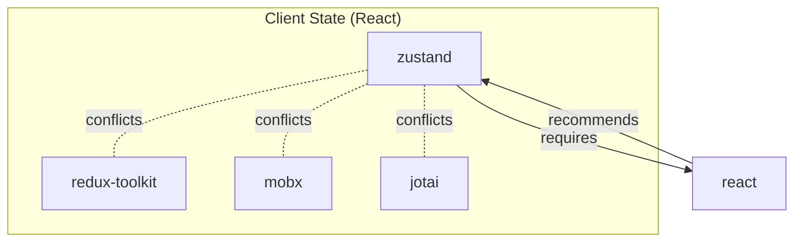

# Skills Matrix Structure Research

> **Purpose**: Evaluate whether the current relationship-centric structure should be replaced with a skill-centric structure.
> **Date**: 2026-01-20
> **Status**: Research Complete
> **Verdict**: **Keep current structure, add tooling**

---

## Executive Summary

Four parallel research agents analyzed the skills-matrix.yaml structure from different perspectives:

1. **Current Structure Analysis** - Identified maintenance pain points
2. **Skill-Centric Design** - Designed alternative structure
3. **CLI Usage Patterns** - Analyzed query efficiency
4. **DRYness Analysis** - Evaluated maintenance burden

**Key Finding**: The current relationship-centric structure is **near-optimal for authoring**. The perceived maintenance pain comes from **lack of tooling** (validation, visualization), not the structure itself. A skill-centric authoring format would **increase maintenance burden** for common operations.

**Recommendation**: Keep the current structure. Add validation and visualization tooling. The existing `MergedSkillsMatrix` already computes a skill-centric view at runtime for CLI queries.

---

## Table of Contents

1. [The Problem Statement](#the-problem-statement)
2. [Current Structure Analysis](#current-structure-analysis)
3. [Proposed Skill-Centric Alternative](#proposed-skill-centric-alternative)
4. [CLI Query Efficiency](#cli-query-efficiency)
5. [DRYness Comparison](#dryness-comparison)
6. [The Bidirectional Relationship Problem](#the-bidirectional-relationship-problem)
7. [Why Skill-Centric Authoring Would Be Worse](#why-skill-centric-authoring-would-be-worse)
8. [Recommended Improvements](#recommended-improvements)
9. [Final Verdict](#final-verdict)

---

## The Problem Statement

The user observed:

> "Everywhere Zustand is applicable it will be included... What if we treated this differently? List all skills where every skill has properties for requires, blocks, alternatives, recommended pairings."

This is a valid concern. Currently, to understand "everything about Zustand," you must:

1. Search `conflicts` section for conflict groups containing "zustand"
2. Search `recommends` section for rules where "zustand" is in `suggest`
3. Search `recommends` section for `when: zustand` rules
4. Find the `requires` entry for "zustand"
5. Search `alternatives` for groups containing "zustand"
6. Search all `suggested_stacks` for "zustand"
7. Find the `skill_aliases` entry for "zustand"

This is **7 different locations** across an 807-line file.

---

## Current Structure Analysis

### Duplication Metrics

| Skill | Total Mentions | Breakdown |
|-------|----------------|-----------|
| `zustand` | 14 | conflicts: 3, recommends: 5, requires: 1, alternatives: 1, stacks: 4 |
| `react` | 18+ | conflicts: 1, recommends: 3, requires: 8, stacks: 5, aliases: 1 |
| `hono` | 10 | recommends: 2, requires: 3, alternatives: 1, stacks: 4 |
| `drizzle` | 12 | conflicts: 1, recommends: 3, requires: 2, alternatives: 1, stacks: 5 |

**Average: ~4.2 mentions per skill** across 60+ unique skills.

### Redundant Conflict Declarations

The same conflict is declared multiple times:

```yaml
# Line 260 - React ecosystem
- skills: [zustand, redux-toolkit, mobx, jotai]
  reason: "React state libraries - choose one approach"

# Line 264 - Vue ecosystem (includes React skills!)
- skills: [pinia, zustand, redux-toolkit, mobx]
  reason: "Pinia is Vue-only, others are React-only"

# Line 268 - Angular ecosystem (includes ALL previous!)
- skills: [ngrx-signalstore, zustand, pinia, redux-toolkit, mobx, jotai]
  reason: "NgRx SignalStore is Angular-only"
```

**Problem**: "zustand conflicts with redux-toolkit" is declared **3 times**. This is:
- Redundant data that must stay in sync
- Error-prone (what if one rule is updated but not others?)
- Semantically confusing (which rule is "authoritative"?)

### CRUD Operation Complexity

| Operation | Edits Required | Cognitive Load |
|-----------|----------------|----------------|
| **Add new skill** | 6-10 locations | HIGH - must find all relevant sections |
| **Change relationship** | 1-2 locations | MEDIUM - find the right section |
| **Delete skill** | 4-10 locations | HIGH - must search entire file |
| **Add skill to stack** | 1 location | LOW |

---

## Proposed Skill-Centric Alternative

### What It Would Look Like

```yaml
skills:
  zustand:
    id: zustand
    full_path: "frontend/client-state-management/zustand (@vince)"
    category: client-state

    requires_any: [react, react-native]
    blocks: [redux-toolkit, mobx, jotai, pinia, ngrx-signalstore]
    alternatives: [redux-toolkit, mobx, jotai]

    pairs_with:
      server-state: react-query
      forms: react-hook-form
      validation: zod-validation

    recommends:
      - skill: react-query
        reason: "Zustand for client state, RQ for server state"
        strength: strong
```

### Estimated Metrics

| Metric | Current | Skill-Centric |
|--------|---------|---------------|
| **Total lines** | 807 | 1,400-1,800 |
| **Lines per skill** | N/A | 20-25 |
| **Skill mentions** | ~4.2 average | 1 (own definition) + references |

### The Bidirectional Problem

If zustand blocks mobx, does mobx also need to list zustand?

**Option A - Single source**: Only zustand declares, mobx inferred
- DRY but confusing: "Who blocks mobx?" requires scanning ALL skills

**Option B - Both declare**: Each skill lists all relationships
- Complete but maximum redundancy: 4-way conflict = 12 declarations

**Option C - Current approach**: Global conflict rule declares once
- `skills: [zustand, mobx, redux, jotai]` = 1 declaration for 4-way conflict

---

## CLI Query Efficiency

### Current Architecture (Already Optimal!)

The system already uses a **hybrid approach**:

```
skills-matrix.yaml          →  MergedSkillsMatrix       →  CLI Queries
(relationship-centric)         (skill-centric)             (O(1) lookups)
       ↓                              ↓                          ↓
   AUTHORING                      RUNTIME                    DISPLAY
```

The `MergedSkillsMatrix` type already stores relationships on each skill:

```typescript
interface ResolvedSkill {
  id: string;
  conflictsWith: SkillRelation[];     // Pre-computed
  recommendedBy: SkillRelation[];     // Pre-computed (inverse!)
  requires: SkillRequirement[];       // Pre-computed
  requiredBy: SkillRelation[];        // Pre-computed (inverse!)
  alternatives: SkillAlternative[];   // Pre-computed
}
```

### Query Complexity Comparison

| Query | Relationship-Centric | Skill-Centric (Runtime) |
|-------|---------------------|------------------------|
| Is skill disabled? | O(C*S + R) scan all rules | O(n*c) direct access |
| Get disable reason | O(C*S + R) | O(c) direct access |
| Filter by category | O(total skills) | O(1) with lookup table |
| Check requirement chain | O(R*D) | O(D) direct recursion |

**Conclusion**: The current system already computes a skill-centric view at runtime. Changing the **authoring format** would not improve query performance.

---

## DRYness Comparison

### The 80/20 Rule

**20% of the structure causing 80% of maintenance pain:**

1. **Recommends rules** (HIGH pain) - Scattered bidirectional relationships
2. **Requires rules** (HIGH pain) - Verbose, easy to forget
3. **Conflict rules** (MEDIUM pain) - Redundant overlap between groups
4. **Skill aliases** (LOW pain) - Simple key-value
5. **Alternatives** (LOW pain) - Rarely change

### Operation Comparison

| Operation | Current (Group-Based) | Skill-Centric |
|-----------|----------------------|---------------|
| Add 4-way conflict | **1 edit** | 4+ edits |
| Add skill to conflict | **1 edit** | 4+ edits |
| Add stack with 8 skills | **1 edit** | 8 edits (to each skill's `in_stacks`) |
| See all relationships | grep (or computed) | Direct |

**Key Insight**: Group-based is better for **authoring**, skill-centric is better for **reading**. The solution is to **author in groups and compute the skill-centric view**.

---

## The Bidirectional Relationship Problem

### Analysis of All Approaches

| Approach | Description | Maintenance | Discovery |
|----------|-------------|-------------|-----------|
| **A: Single source** | Only A declares A→B | 1 edit | Must scan all skills |
| **B: Both sides** | A and B both declare | 2+ edits | Direct lookup |
| **C: Global rules** | Group declaration | 1 edit | Computed at runtime |

### Why Current Approach Wins

For N-way conflicts (common pattern):

| N | Single Source | Both Sides | Global Rule |
|---|---------------|------------|-------------|
| 2 | 1 edit | 2 edits | **1 edit** |
| 3 | 1 edit | 6 edits | **1 edit** |
| 4 | 1 edit | 12 edits | **1 edit** |
| 5 | 1 edit | 20 edits | **1 edit** |

**State managers**: 6 options (zustand, redux, mobx, jotai, pinia, ngrx)
- Global rule: 1 declaration
- Both sides: 30 declarations!

---

## Why Skill-Centric Authoring Would Be Worse

### The Hidden Multiplication

Moving to skill-centric authoring would **multiply edits** for common operations:

1. **Adding a new state manager** (e.g., `xstate`):
   - Current: Add to conflict group (1 edit) + alias (1 edit) + requires (1 edit) = **3 edits**
   - Skill-centric: Create skill (1) + add to zustand.blocks (1) + add to redux.blocks (1) + add to mobx.blocks (1) + add to jotai.blocks (1) = **5+ edits**

2. **Creating a new suggested stack with 8 skills**:
   - Current: Create stack block (1 edit) = **1 edit**
   - Skill-centric: Create stack (1) + update 8 skills' `in_stacks` = **9 edits**

3. **Changing "zustand recommends react-query" to "zustand recommends swr"**:
   - Current: Edit the `when: zustand` rule = **1 edit**
   - Skill-centric: Edit zustand.recommends (1) + edit react-query.recommended_by (1) + add swr.recommended_by (1) = **3 edits**

---

## Recommended Improvements

### Keep Current Structure + Add Tooling

Instead of restructuring, add these capabilities:

### 1. Validation Script

```typescript
// scripts/validate-matrix.ts
function validateMatrix(config: SkillsMatrixConfig): ValidationResult {
  const errors: string[] = [];

  // Check all skill references exist in aliases
  for (const rule of config.relationships.conflicts) {
    for (const skill of rule.skills) {
      if (!config.skill_aliases[skill]) {
        errors.push(`Unknown skill "${skill}" in conflict rule`);
      }
    }
  }

  // Check for orphan skills (defined but never used)
  // Check for duplicate conflict declarations
  // Check for circular requirements

  return { valid: errors.length === 0, errors };
}
```

### 2. Skill Card Generator

Generate a computed "skill card" showing all relationships:

```yaml
# Generated: .claude/computed/skill-cards/zustand.yaml
zustand:
  full_id: "frontend/client-state-management/zustand (@vince)"

  # Computed from skills-matrix.yaml
  conflicts_with:
    - redux-toolkit (React state libraries - choose one)
    - mobx (React state libraries - choose one)
    - jotai (React state libraries - choose one)
    - pinia (cross-framework)
    - ngrx-signalstore (cross-framework)

  recommended_by:
    - react (Best-in-class React libraries)
    - nextjs-app-router (Next.js App Router ecosystem)
    - remix (Remix-compatible libraries)
    - react-native (React Native shares React ecosystem)

  requires:
    - ANY OF: [react, react-native] (Zustand is React/React Native only)

  alternatives:
    - redux-toolkit (Client State React)
    - mobx (Client State React)
    - jotai (Client State React)

  in_stacks:
    - modern-react
    - modern-react-tailwind
    - mobile-stack
    - full-observability
```

### 3. Visualization Generator

Generate Mermaid diagrams:



### 4. Deduplication of Conflict Groups

Consolidate overlapping conflict rules:

```yaml
# BEFORE: 3 overlapping rules
- skills: [zustand, redux-toolkit, mobx, jotai]
- skills: [pinia, zustand, redux-toolkit, mobx]
- skills: [ngrx-signalstore, zustand, pinia, redux-toolkit, mobx, jotai]

# AFTER: 2 clear rules
- skills: [zustand, redux-toolkit, mobx, jotai]
  reason: "React state management - choose one"

- skills: [pinia, ngrx-signalstore]
  reason: "Framework-specific state (Vue/Angular)"
  # Cross-framework conflicts handled by category_exclusive + requires
```

### 5. Category-Inferred Conflicts

Use `exclusive: true` on categories to auto-generate conflicts:

```yaml
categories:
  client-state:
    exclusive: true  # Auto-generates conflicts between all skills in category
```

Then explicit conflicts only needed for **cross-category** cases.

---

## Final Verdict

### Decision: Keep Current Structure

| Factor | Current | Skill-Centric |
|--------|---------|---------------|
| **N-way conflict edits** | 1 | N+ |
| **Add skill to group** | 1 | N+ |
| **Stack creation** | 1 | 1 + N |
| **Single-skill view** | Computed | Direct |
| **Total lines** | 807 | 1,400-1,800 |
| **Sync risk** | Low | High |

### The Real Solution

The pain comes from **lack of tooling**, not the data structure:

1. ✅ **Validation** - Catch typos and orphans
2. ✅ **Visualization** - See relationships at a glance
3. ✅ **Computed skill cards** - Skill-centric view for reading
4. ✅ **Deduplication** - Clean up redundant conflict rules
5. ✅ **Category inference** - Reduce explicit declarations

### Architecture Summary

```
┌─────────────────────────────────────────────────────────────────┐
│                     AUTHORING LAYER                              │
│                  (skills-matrix.yaml)                            │
│                                                                  │
│  • Relationship-centric (group-based)                           │
│  • Efficient for N-way relationships                            │
│  • Categories + conflicts + recommends + requires               │
│  • Single source of truth                                       │
└───────────────────────────┬─────────────────────────────────────┘
                            │
                            │ compile/merge
                            ▼
┌─────────────────────────────────────────────────────────────────┐
│                     RUNTIME LAYER                                │
│                 (MergedSkillsMatrix)                             │
│                                                                  │
│  • Skill-centric (pre-computed)                                 │
│  • Direct property access: skill.conflictsWith                  │
│  • Inverse relationships: skill.recommendedBy                   │
│  • O(1) lookups for CLI queries                                 │
└───────────────────────────┬─────────────────────────────────────┘
                            │
                            │ query
                            ▼
┌─────────────────────────────────────────────────────────────────┐
│                     CLI LAYER                                    │
│               (MatrixQueryEngine)                                │
│                                                                  │
│  • isDisabled(skillId, selections)                              │
│  • isRecommended(skillId, selections)                           │
│  • getSkillsInCategory(categoryId)                              │
│  • Optional lookup tables for hot paths                         │
└─────────────────────────────────────────────────────────────────┘
```

**This hybrid architecture is correct.** The authoring format optimizes for maintenance; the runtime format optimizes for queries. Changing the authoring format to skill-centric would degrade the maintenance experience without improving runtime performance.

---

## Action Items

1. [ ] Create validation script (`scripts/validate-matrix.ts`)
2. [ ] Create skill card generator (`scripts/generate-skill-cards.ts`)
3. [ ] Create Mermaid visualization generator
4. [ ] Deduplicate overlapping conflict rules
5. [ ] Document category_exclusive auto-conflict behavior
6. [ ] Consider YAML anchors for exact duplicate lists (optional)

---

_Research completed: 2026-01-20_
_Agents used: 4 parallel research agents with deep analysis_
