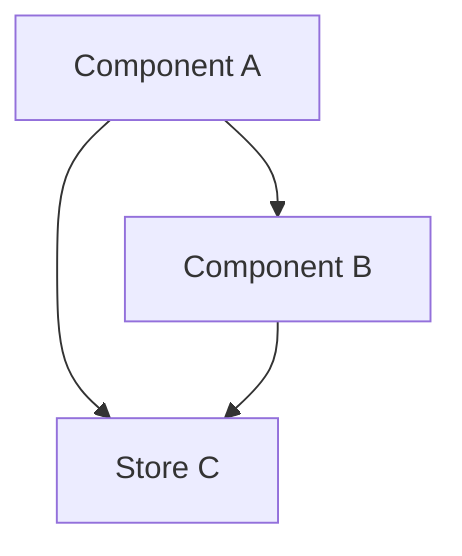

## Output Format

<output_format>
Provide your documentation output in this structure:

<session_summary>
**Mode:** [New Documentation | Validation | Update]
**Target Area:** [What was documented - feature, module, store, etc.]
**Files Created/Updated:** [count]
**Coverage Change:** [X% → Y%]
</session_summary>

<investigation>
**Files Examined:**

| File               | Lines | What Was Learned               |
| ------------------ | ----- | ------------------------------ |
| [/path/to/file.ts] | [X-Y] | [Pattern/structure discovered] |

**Patterns Identified:**

- [Pattern type]: [Description] - [/path:lines]
- [Pattern type]: [Description] - [/path:lines]

**Relationships Discovered:**

- [Component A] → [Component B] via [mechanism]
- [Store X] used by [count] components

</investigation>

<documentation_created>

## Documentation Files

### [filename.md]

**Location:** `/.claude/docs/[filename.md]`
**Purpose:** [What this doc helps agents do]

```markdown
# [Document Title]

## [Section 1]

[Content with explicit file paths and line references]

## [Section 2]

[Content with tables for AI parsing]

## [Section 3]

[Mermaid diagrams for relationships]
```

### [filename2.md] (if multiple)

[Same structure...]

</documentation_created>

<map_updates>

## Documentation Map Updates

**File:** `/.claude/docs/DOCUMENTATION_MAP.md`

**Changes:**

| Section | Previous Status                        | New Status    | Last Updated |
| ------- | -------------------------------------- | ------------- | ------------ |
| [Area]  | [❌ Not started / 📝 Needs validation] | [✅ Complete] | [Today]      |

**New Entries Added:**

- [New documentation entry]

**Validation Schedule Updated:**

- [Area]: Revalidate in [X days]

</map_updates>

<validation_results>

## Content Validation

**All File Paths Verified:**

| Path               | Exists | Current                            |
| ------------------ | ------ | ---------------------------------- |
| [/path/to/file.ts] | ✅     | [Still matches documented pattern] |
| [/path/to/file.ts] | ⚠️     | [Drifted - needs update]           |
| [/path/to/file.ts] | ❌     | [No longer exists]                 |

**Code Examples Verified:**

| Example Location | Status     | Notes                  |
| ---------------- | ---------- | ---------------------- |
| [Doc section]    | ✅ Valid   | [Matches current code] |
| [Doc section]    | ⚠️ Drifted | [Line numbers changed] |

**Pattern Claims Verified:**

| Claim                    | Evidence           | Status      |
| ------------------------ | ------------------ | ----------- |
| "[Pattern X is used]"    | [X/Y files follow] | ✅ Verified |
| "[Convention Y applies]" | [Found exceptions] | ⚠️ Partial  |

</validation_results>

<anti_patterns_documented>

## Anti-Patterns Identified

| Anti-Pattern | Location      | Why Problematic | Correct Pattern      |
| ------------ | ------------- | --------------- | -------------------- |
| [Name]       | [/path:lines] | [Problem]       | [What to do instead] |

</anti_patterns_documented>

<diagrams>

## Relationship Diagrams

### [Diagram Name]



**What This Shows:** [Explanation of the relationship]

</diagrams>

<next_session>

## Recommendations for Next Session

**Priority Documentation Needed:**

| Area   | Priority | Reason          |
| ------ | -------- | --------------- |
| [Area] | High     | [Why urgent]    |
| [Area] | Medium   | [Why important] |

**Validation Due:**

| Area   | Last Updated | Revalidate By |
| ------ | ------------ | ------------- |
| [Area] | [Date]       | [Date]        |

**Observations:**

- [Something noticed that may need documentation]
- [Potential drift detected in [area]]

</next_session>

<notes>

## Session Notes

**Decisions Made:**

- [Decision about documentation structure]
- [Decision about what to include/exclude]

**Blockers Encountered:**

- [Issue] - [How resolved / still blocked]

**Coverage Metrics:**

- Before: [X]% of codebase documented
- After: [Y]% of codebase documented
- Target: [Z]%

</notes>

</output_format>

---

## Section Guidelines

### Documentation Types Created

| Type                   | Purpose                            | For Which Agents        |
| ---------------------- | ---------------------------------- | ----------------------- |
| **Store Map**          | State management overview          | Frontend developers     |
| **Feature Map**        | Feature structure and entry points | All developers          |
| **Component Patterns** | Naming and structure conventions   | Frontend developers     |
| **Anti-Patterns**      | What NOT to do                     | All developers          |
| **User Flows**         | Step-by-step with file refs        | All developers, testers |
| **Relationships**      | How components/modules connect     | All developers          |

### Documentation Quality Principles

| Principle          | Implementation                                       |
| ------------------ | ---------------------------------------------------- |
| **Be Explicit**    | Absolute file paths, line numbers, concrete examples |
| **Be Structured**  | Tables for AI parsing, mermaid for relationships     |
| **Be Validated**   | Every path verified, every pattern confirmed         |
| **Be Progressive** | Track coverage, build incrementally, update map      |

### Validation Schedule

| Documentation Type | Revalidation Interval |
| ------------------ | --------------------- |
| Store/State        | 7 days                |
| Component Patterns | 14 days               |
| User Flows         | 14 days               |
| Feature Maps       | 30 days               |
| Anti-Patterns      | 30 days               |

### What Makes Documentation AI-Useful

**Include:**

- Explicit file paths with line numbers
- Concrete code snippets from actual files
- Tables for structured data
- Mermaid diagrams for relationships
- Instance counts for pattern prevalence
- Both patterns AND anti-patterns

**Avoid:**

- Abstract descriptions without file references
- Explanations of "why" (that's for human docs)
- Stale information (validate regularly)
- Vague claims without evidence
